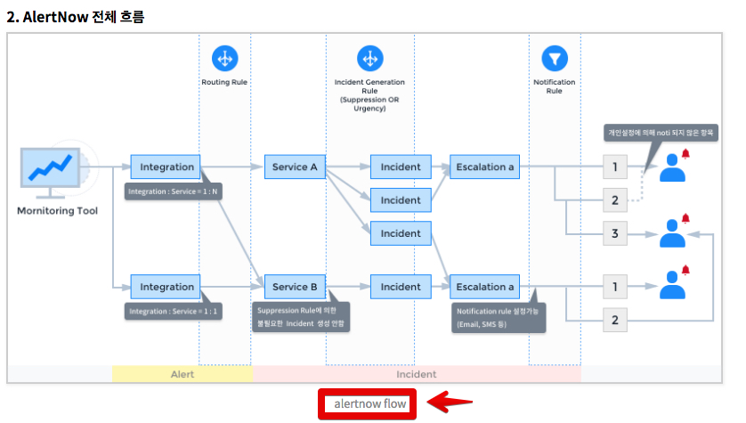
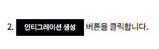
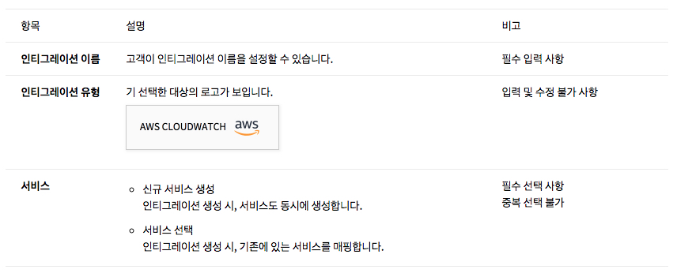
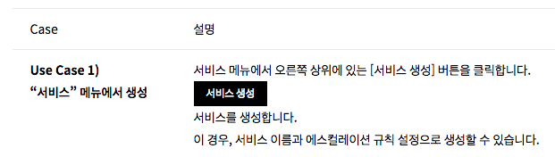

<!-- TOC -->
# OpsNow manual build system  

## 도움말 작성자를 위한 설명

세상에는 많고 많은 마크다운 format이 존재하지만 그중에 **pandoc markdown**을 채택했습니다.  
테이블 안의 td셀에서 markdown을 추가 작성하거나, 셀 내의 임의개행을 할 수 있는 등 유연하게 테이블을 지원하고 있고, 아웃풋으로 html/LaTex/ePub/pdf등 다양한 포맷을 지원합니다.

기본적인 마크다운 문법은 다음의 링크를 참조해주세요.

-   [기본 마크다운 문법](https://daringfireball.net/projects/markdown/)
-   [pandoc에서 지원하는 마크다운 문법](https://pandoc.org/MANUAL.html)


### 파일 네이밍

마크다운 파일의 네이밍은 아래 규칙을 따릅니다.

> user-guide-서비스명-언어.md

예시로 보시면 

> user-guide-alertnow-ko.md

> user-guide-alertnow-en.md

> user-guide-alertnow-zh.md

파일을 신규 생성하실 경우 **반드시 지켜주셔야 합니다**.  
이름 기반으로 다국어 링크등이 추가되거나, 파일의 존재 유무를 파악하므로 파일명의 규칙을 지키는 것은 매우 중요합니다.


### 이미지

이미지는 각 언어셋 내의 `resource` 디렉토리에 위치합니다.
서버가 없이도 확인과 배포를 쉽게 하기 위해서 상대경로를 사용합니다.

markdown 파일 본문에 아래처럼 작성합니다.

**opsnow의 도움말은 고밀도 디스플레이를 지원**하고 있습니다.  
만일 고밀도 모니터에서 촬영한 이미지가 있다면 파일명 맨 뒤에 `@2x`를 surfix로 붙여주세요.  
markdown을 html로 변경하며 이미지 크기를 줄여 보여주는 property 삽입 처리를 합니다.


아래 그림처럼 이미지의 중간에 설명이 있는 형태를 작성하고 싶으시면 아래처럼 코드를 작성해주세요.




```


![alertnow][alertnow_flow]
    ^^^^^      ^^^^^
      1          2
1.  설명으로 쓰일 문장
```

**참고사항**

-   **Gulp 구동중 이미지를 추가할 경우 이를 반영하지 못하는 문제가 있습니다. (Gulp.js 자체의 특성) 
    실행중이던 task를 종료하고, 새로 gulp를 구동해 주세요.**
-   이미지 내의 붉은색 안내선이나 화살표 등의 장식은 아직 규칙이 정해진것이 없습니다.


#### 제목(대제목,소제목)

heading을 작성하면 heading을 그대로 LNB링크 뭉치로 생성합니다.
각 제목은 html h1~h6의 heading 엘리먼트로 변환되며 왼쪽의 local navigation bar에 있는 메뉴 링크로 생성됩니다. 

왼쪽 메뉴링크 생성(LNB)을 자동생성하지 않고 사용자가 지정한 단어로 링크를 생성할 수 있습니다.
한글은 엔티티 문자로 변환되고, 특수기호는 **대시 -** 로 변환되어 링크를 생성합니다.
자세한 사항은 [pandoc 매뉴얼의 header-identifier](https://pandoc.org/MANUAL.html#header-identifiers)를 참조하세요.

아래는 커스텀 제목을 작성하는 간략한 예시입니다.

```

// markdown

### 인시던트 {#incident}
### incidents {#incident}


// 이렇게 작성된 코드가 html에서는 이렿게 변화됩니다.

// lnb 
<li class="active"><a href="#incident" class="active">인시던트</a><ul>      //// 귝뮨
<li class="active"><a href="#incident" class="active">Incidents</a><ul>     ////  영문

// 본문
<h2 id="incident">인시던트</h2>     //// 국문
<h2 id="incident">Incidents</h2>    //// 영문

```


#### 버튼 모양을 표현하고 싶을 때



그림 처럼 버튼 모양을 표현하고 싶을떄는 html 태그를 직접 기술합니다.

``` html
<span class="demo black button">인티그레이션 생성</span>
```

2018.05.10 18:36 현재 검은색 중간크기 버튼모양만 설정되어 있습니다.  
다른 추가 모양이 필요하시면 UI개발자에게 문의하세요. 아니면 직접 스타일을 추가해서 사용하셔도 됩니다.


#### 테이블


기본이 되는 테이블 문법은 아래와 같습니다.

각 행의 구분을 `-`로 하며, 열간의 구문은 `+`와 `|`로 표시합니다.
테이블 셀의 제목이 있는 경우, 제목 아래 구분선에 `=`로 표시합니다.

``` 
에) 열의 제목이 없는 테이블 문법
+---------+---------------------------------------------------+
| 내용 11 | 내용 12
+---------+---------------------------------------------------+
| 내용 21 | 내용 22
+---------+---------------------------------------------------+
| 내용 31 | 내용 32
+---------+---------------------------------------------------+

에) 열의 제목이 있는 테이블 문법
+---------+---------------------------------------------------+
| 제목 1  | 제목 2
+=========+===================================================+ <<<<
| 내용 1  | 내용 2
+---------+---------------------------------------------------+

예) 열의 제목이 있는 테이블 문법
+---------+---------------------------------------------------+
| Preset  | 기간
+=========+===================================================+
| 전체    | 인시던트가 발생한 전체 기간을 검색합니다.
+---------+---------------------------------------------------+
| 오늘    | 현재 날짜를 선택한다.
+---------+---------------------------------------------------+
| 어제    | 어제의 날짜를 선택한다.
+---------+---------------------------------------------------+
```

테이블 안에 목록형 문법과 이미지를 추가할 수 있습니다.

``` 
+-------------------+---------------------------------------------------------------+-----------------------+
| 항목              |  설명                                                         | 비고
+===================+===============================================================+=======================+
| 인티그레이션 이름 |  고객이 인티그레이션 이름을 설정할 수 있습니다.               | 필수 입력 사항
+-------------------+---------------------------------------------------------------+-----------------------+
| 인티그레이션 유형 |  기 선택한 대상의 로고가 보입니다.                            | 입력 및 수정 불가 사항
|                   |  ![][service_case2_04_AWS]                                    |
+-------------------+---------------------------------------------------------------+-----------------------+
| 서비스            |  -    신규 서비스 생성                                        | 필수 선택 사항  
|                   |       인티그레이션 생성 시, 서비스도 동시에 생성합니다.       | 중복 선택 불가
|                   |  -    서비스 선택                                             |
|                   |       인티그레이션 생성 시, 기존에 있는 서비스를 매핑합니다.  |
+-------------------+---------------------------------------------------------------+-----------------------+

```

변환결과  



테이블 안에 html을 추가할 수 있습니다.

``` 
+---------------------------+--------------------------------------------------------------------------+
| Case                    	|  설명
+===========================+==========================================================================+
| Use Case 1)               |  서비스 메뉴에서 오른쪽 상위에 있는 “서비스 생성” 버튼을 클릭 합니다.
| “서비스” 메뉴에서 생성    |  <button class="demo black">서비스 생성</button>
|                           |  서비스를 생성 합니다.
|                           |  이 경우, 서비스 이름과 에스컬레이션 규칙 설정으로 생성 할 수 있습니다.
+---------------------------+--------------------------------------------------------------------------+
```

변환결과 




**주의사항**

-   **셀 병합을 지원하지 않습니다**.
    셀 병합이 있는 경우 반드시 컨텐트 구성에서 케이스 따라 재량껏 풀어서 써주셔야 됩니다.


행간 구분선에 따라 테이블 셀간 넓이가 결정됩니다.

``` markdown
예) 왼쪽 셀보다 오른쪽 셀이 더 넓은 테이블이 그려집니다.

>> 마크다운 테이블 문법
+--------------------+-----------------------------------------+
|                    |  
+====================+=========================================+
|                    |  
|                    |  
|                    |  
|                    |  
+--------------------+-----------------------------------------+

>>변환 결과
...
\<col width="35%" /\>
\<col width="65%" /\>
...


예) 오른쪽 셀보다 왼쪽 셀이 더 넓은 테이블이 그려집니다.
>>마크다운 테이블 문법
+--------------------------------------+----------------------+
|                        	           |
+======================================+======================+
|                                      |
|                                      |
|                                      |
|                                      |
+--------------------------------------+----------------------+

>> 변환결과
...
\<col width="65%" /\>
\<col width="35%" /\>
...

```
예시로는 두가지 열만 보여드렸지만 다중열 테이블의 경우도 마찬가지로 눈에 보이는 셀의 넓이가 거의 그대로 반영됩니다.


#### 이미지 넣기

아래 두가지 방법 어느것을 사용하셔도 무방합니다.

``` markdown
이미지 위치를 잡고 설명을 추가하는 방법

![이미지 설명][이미지 링크]
...(중략)...
[이미지 링크]: ./resource/이미지 주소.확장자

// 예시)
![인티그레이션 설명][integration_01]
...(중략)...
[integration_01]: ./resource/bnr_service_case2_01_ko.png


-----------------------------------------------------

이미지 위치와 설명을 같이 쓰는 방법


// 예시)


```

**opsnow의 이미지 포맷은 고밀도 디스플레이(레티나, 맥북프로등...)를 지원해야 합니다**.
따라서 스크린샷 촬영시 가급적 고밀도 디스플레이에서 촬영해 주시고.
일반 모니터(72ppi)로 촬영하셨을 경우 이미지 이름에 `@2x`라는 prefix를 붙여주세요.

예시
-   고밀도 디스플레이에서 스크린샷한 이미지의 경우 : bnr_service_case2_01_ko@2x.png
-   일반 모니터에서 스크린샷한 이미지의 경우 : bnr_service_case2_01_ko.png

``` markdown
![이미지 설명][이미지 링크]
[이미지 링크]: ./resource/이미지 주소.확장자 {sizes=normal}

 {sizes=normal}

// 예시)
![인티그레이션 설명][integration_01]
[integration_01]: ./resource/bnr_service_case2_01_ko@2x.png {sizes=normal}

 {sizes=normal}

```

마크다운 파일을 html로 변환할때 이미지를 50% 크기로 불러오게 하는 장치가 되어있는데, `{sizes=normal}`이란 플래그를 발견하면 이미지 크기를 원래 크기대로 보여주게 html 코드가 설정됩니다.


더 자세한 설명을 원하시면 [pandoc markdown의 이미지 항목 설명][pandoc#image]을 보아주세요.


### 에디터

실시간으로 pandoc-markdown을 파싱할 수 있는 편집기면 아무거나 사용하셔도 됩니다. [이 링크](https://github.com/jgm/pandoc/wiki/Pandoc-Extras#editors)에 자세한 설명이 있습니다.

-   [Markdown monster](https://markdownmonster.west-wind.com/) (windows)
-   [TEXTS](http://www.texts.io/support/) (windows,mac)
-   [ghost writer](https://wereturtle.github.io/ghostwriter/) (windows & linux)
-   [marked 2](http://marked2app.com/) (mac, 유료)

다른 방법으로 로컬에서도 웹서버를 설정해 확인할 수도 있습니다.


### 환경 설정 구문

각 도움말 markdown 파일 상단에는 설정에 관련된 값이 적혀 있습니다.

기본 포맷 예시

``` yaml
---
service : alertnow
title   : AlertNow
ko : true
multiLang: 
    - ko : false
    - en : true 
    - zh : false
...
```

-   service : 
    서비스명을 적어줍니다. 파일명 등에 쓰입니다. 전부 소문자로 작성합니다.

-   title   : 
    페이지 제목을 적어줍니다. h1 등의 타이틀 엘리먼트에 사용됩니다.

-   en/ko/zh : true
    작성하는 문서가 영문/한글/중문에 따라서 기술합니다.
    **문법 규칙상 *true* 만 존재합니다.**
    `예) ko : true`

-   multiLang:
    다국어 문서의 링크 생성을 위해 기술합니다.
    기본적으로 ko/en/zh의 세가지 유형을 가집니다.

    **현재 기술하고 있는 문서에 대한 언어는 반드시 반대로 설정하시거나 삭제하셔야 합니다**.

    예) 

    ``` yaml 
    en : true

    ...

    multiLang:
        - en : false
    ```

[pandoc#image]: https://pandoc.org/MANUAL.html#images
[pandoc_link]: https://pandoc.org/MANUAL.html


