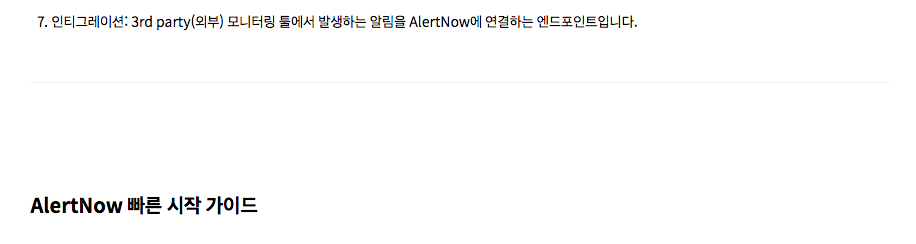

<!-- TOC -->
# OpsNow manual build system  

## 도움말 작성자를 위한 설명

세상에는 많고 많은 마크다운 format이 존재하지만 그중에 **pandoc markdown**을 채택했습니다.  
테이블 안의 td셀에서 markdown을 추가 작성하거나, 셀 내의 임의개행을 할 수 있는 등 유연하게 테이블을 지원하고 있고, 아웃풋으로 html/LaTex/ePub/pdf등 다양한 포맷을 지원합니다.

기본적인 마크다운 문법은 다음의 링크를 참조해주세요.

-   [기본 마크다운 문법](https://daringfireball.net/projects/markdown/)
-   [pandoc에서 지원하는 마크다운 문법](https://pandoc.org/MANUAL.html)


### 파일 네이밍

마크다운 파일의 네이밍은 아래 규칙을 따릅니다.

> user-guide-서비스명-언어.md

예시로 보시면 

> user-guide-alertnow-ko.md

> user-guide-alertnow-en.md

> user-guide-alertnow-zh.md

파일을 신규 생성하실 경우 **반드시 지켜주셔야 합니다**.  
이름 기반으로 다국어 링크등이 추가되거나, 파일의 존재 유무를 파악하므로 파일명의 규칙을 지키는 것은 매우 중요합니다.


--------------------------------------------------------------------------------


### 환경 설정 구문

각 도움말 markdown 파일 상단에는 빌드 설정에 관련된 규칙이 YAML 포맷으로 적혀 있습니다.


``` yaml
---
service : alertnow
title   : AlertNow
ko : true
...
```

-   service : 
    서비스명을 적어줍니다. 파일명 등에 쓰입니다. 전부 소문자로 작성합니다.

-   title   : 
    페이지 제목을 적어줍니다. h1 등의 타이틀에 사용됩니다.

-   en/ko/zh : true
    작성하는 문서가 영문/한글/중문에 따라서 기술합니다.
    **문법 규칙상 *true* 만 존재합니다.**
    `예) ko : true`


--------------------------------------------------------------------------------


### 제목

제목은 문서구조의 목차에 맞게 작성해주시면 연번과 LNB의 링크가 자동으로 생성됩니다.(Table of contents, TOC)

outline 구조에 맞춰 작성된 제목은 목차로써의 역할과 메뉴 링크의 역할을 담당하게 됩니다.
목차 작성하듯 순서에 맞춰 문서 구조를 잡아가시면 됩니다.


#### 소제목과 LNB의 연동
heading을 작성하면 heading을 그대로 LNB링크 뭉치로 생성합니다.
각 제목은 html h1~h6의 heading 엘리먼트로 변환되며 왼쪽의 local navigation bar에 있는 메뉴 링크로 생성됩니다. 
한글은 엔티티 문자로 변환되고, 특수기호는 **대시 -** 로 변환되어 링크를 생성합니다.

#### internal link 주소 생성 기능

왼쪽 메뉴링크 생성(LNB)을 자동생성하지 않고 사용자가 지정한 단어로 링크를 생성할 수 있습니다.
자세한 사항은 [pandoc 매뉴얼의 header-identifier](https://pandoc.org/MANUAL.html#header-identifiers)를 참조하세요.

아래는 커스텀 제목을 작성하는 간략한 예시입니다.

```
// markdown

### 인시던트 {#incident}
### incidents {#incident}


// 이렇게 작성된 코드가 html에서는 이렿게 변화됩니다.

// lnb 
<li class="active"><a href="#incident" class="active">인시던트</a><ul>      //// 귝뮨
                            ^^^^^^^^^
<li class="active"><a href="#incident" class="active">Incidents</a><ul>     ////  영문
                            ^^^^^^^^^

// 본문
<h2 id="incident">인시던트</h2>     //// 국문
        ^^^^^^^^
<h2 id="incident">Incidents</h2>    //// 영문
        ^^^^^^^^
```


--------------------------------------------------------------------------------


### 이미지

본문에 이미지를 추가하는 방법은 마크다운어느것을 사용하셔도 무방합니다.

``` 
//이미지 위치를 잡고 설명을 추가하는 방법

![이미지 설명][이미지 링크]
...(중략)...
[이미지 링크]: ./resource/이미지 주소.확장자

// 예시)
![인티그레이션 설명][integration_01]
...(중략)...
[integration_01]: ./resource/bnr_service_case2_01_ko.png


//이미지 위치와 설명을 같이 쓰는 방법


// 예시)


```

더 자세한 설명을 원하시면 [pandoc markdown의 이미지 항목 설명][pandoc#image]을 보아주세요.


#### 이미지 파일 위치

이미지는 각 언어셋 내의 `resource` 디렉토리에 위치합니다.
서버가 없이도 확인과 배포를 쉽게 하기 위해서 상대경로를 사용합니다.

#### 고밀도 디스플레이(retina) 지원

**opsnow의 도움말은 고밀도 디스플레이를 지원**하고 있습니다.  
만일 고밀도 모니터에서 촬영한 이미지가 있다면 파일명 맨 뒤에 `@2x`를 surfix로 붙여주세요.  

예시

>   고밀도 디스플레이에서 스크린샷한 이미지의 경우 : bnr_service_case2_01_ko@2x.png  
>   일반 모니터에서 스크린샷한 이미지의 경우 : bnr_service_case2_01_ko.png

markdown을 html로 변경하며 이미지 크기를 줄여 보여주는 property 삽입 처리를 합니다.


#### 설명이 있는 이미지

그림처럼 이미지의 중간에 설명이 있는 형태를 작성하고 싶으시면 이미지 추가의 아래위로 빈 줄을 생성해주세요.


```

    ^^^^^          ^^^^^
      1              2

1.  설명으로 쓰일 문장
2.  그림 파일의 위치
```


**참고사항**

-   **Gulp 구동중 이미지를 추가할 경우 이를 반영하지 못하는 문제가 있습니다. (Gulp.js 자체의 특성) 실행중이던 task를 종료하고, 새로 gulp를 구동해 주세요.**
-   이미지 내의 붉은색 안내선이나 화살표 등의 장식은 아직 정해진 규칙이 없습니다. 


--------------------------------------------------------------------------------


### 테이블


기본이 되는 테이블 문법은 아래와 같습니다.

각 행의 구분을 `-`로 하며, 열간의 구문은 `+`와 `|`로 표시합니다.
테이블 셀의 제목이 있는 경우, 제목 아래 구분선에 `=`로 표시합니다.

``` 
// 기초 

+---------+---------------------------------------------------+
| 내용 1  | 내용 2
+---------+---------------------------------------------------+
| 내용 1  | 내용 2
+---------+---------------------------------------------------+
| 내용 1  | 내용 2
+---------+---------------------------------------------------+

// 단순 축약형태 문법(지원은 되나 권장하지 않습니다)

내용1    내용 2
-----    -------------------------------
내용1    내용 2
내용1    내용 2
내용1    내용 2
내용1    내용 2


// 행의 제목이 있음

+---------+---------------------------------------------------+
| 제목 1  | 제목 2
+=========+===================================================+ 
| 내용 1  | 내용 2
+---------+---------------------------------------------------+
| 내용 1  | 내용 2
+---------+---------------------------------------------------+
| 내용 1  | 내용 2
+---------+---------------------------------------------------+

```


#### 테이블 안애 개행 추가

아래 문법처럼 띄어쓰고 싶은 곳에 한줄 더 생성해주시면 됩니다.

```
// 개행 없음

+-------------------+------------------------------------------------+
| 항목              |  설명
+===================+================================================+
| 인티그레이션 이름 |  고객이 인티그레이션 이름을 설정할 수 있습니다.
+-------------------+------------------------------------------------+


// 개행 있음

+-------------------+------------------------------------------------+
| 항목              |  설명
+===================+================================================+
| 인티그레이션 이름 |  고객이 인티그레이션 
|                   |  이름을 설정할 수 있습니다.
+-------------------+------------------------------------------------+
```


### 테이블 안에 목록형 문법과 이미지 추가

테이블 안에 목록형 문법과 이미지를 추가할 수 있습니다.

``` 
+-------------------+---------------------------------------------------------------+-----------------------+
| 항목              |  설명                                                         | 비고
+===================+===============================================================+=======================+
| 인티그레이션 이름 |  고객이 인티그레이션 이름을 설정할 수 있습니다.               | 필수 입력 사항
+-------------------+---------------------------------------------------------------+-----------------------+
| 인티그레이션 유형 |  기 선택한 대상의 로고가 보입니다.                            | 입력 및 수정 불가 사항
|                   |  ![][service_case2_04_AWS]                                    |
+-------------------+---------------------------------------------------------------+-----------------------+
| 서비스            |  -    신규 서비스 생성                                        | 필수 선택 사항  
|                   |       인티그레이션 생성 시, 서비스도 동시에 생성합니다.       | 중복 선택 불가
|                   |  -    서비스 선택                                             |
|                   |       인티그레이션 생성 시, 기존에 있는 서비스를 매핑합니다.  |
+-------------------+---------------------------------------------------------------+-----------------------+

```


#### 테이블 안에 html raw code 추가

테이블 안에 html을 추가할 수 있습니다.

``` 
+---------------------------+--------------------------------------------------------------------------+
| Case                    	|  설명
+===========================+==========================================================================+
| Use Case 1)               |  서비스 메뉴에서 오른쪽 상위에 있는 “서비스 생성” 버튼을 클릭 합니다.
| “서비스” 메뉴에서 생성    |  <button class="demo black button">서비스 생성</button>
|                           |  서비스를 생성 합니다.
|                           |  이 경우, 서비스 이름과 에스컬레이션 규칙 설정으로 생성 할 수 있습니다.
+---------------------------+--------------------------------------------------------------------------+
```


#### 셀 간 넓이의 수동 지정

행간 구분선에 따라 테이블 셀간 넓이가 결정됩니다. 마크다운으로 작성된 테이블의 셀의 넓이가 거의 그대로 반영됩니다.  


``` markdown
// 왼쪽 셀보다 오른쪽 셀이 더 넓은 테이블이 그려집니다.

+------+------------------------------------------------------+
| 하나 | 둘
+======+======================================================+
| 하나 | 둘
+------+------------------------------------------------------+
| 하나 | 둘 
+------+------------------------------------------------------+


// 오른쪽 셀보다 왼쪽 셀이 더 넓은 테이블이 그려집니다.

+--------------------------------------------------------+----+
| 하나                                                   | 둘 
+========================================================+====+
| 하나                                                   | 둘 
+--------------------------------------------------------+----+
| 하나                                                   | 둘 
+--------------------------------------------------------+----+
```


#### 테이블 작성시 주의사항

-   **셀 병합을 지원하지 않습니다**.
    셀 병합이 있는 경우 반드시 컨텐트 구성에서 케이스 따라 재량껏 풀어서 써주셔야 됩니다.
-   **테이블의 위와 아래 반드시 한줄 이상의 빈줄이 있어야** 합니다.  
    **빈줄이 없을경우 테이블이 그려지지 않습니다**.


--------------------------------------------------------------------------------


### 버튼 모양을 표현하고 싶을 때

버튼 모양을 표현하고 싶을떄는 html 태그를 직접 기술합니다.

``` html
<span class="demo black button">인티그레이션 생성</span>
```


현재는 검은색 중간크기 버튼모양만 설정되어 있습니다.  
다른 추가 모양이 필요하시면 UI개발자에게 문의하세요. 아니면 직접 스타일을 추가해서 사용하셔도 됩니다.


--------------------------------------------------------------------------------


### 접속경로를 표현할때


문서 중간에 그림과 같은 접속경로를 표현하고 싶으시면 아래처럼 구문을 설정해주세요.

```
> 접속경로 : 인시던트 > *인시던트* 
```


--------------------------------------------------------------------------------


### 강조표시

강조(두껍게, bold) 표시에 대한 문법은 두가지 모두 동일하게 화면에 표현되도록 처리되어 있습니다.

```
*조금 강조*
**많이 강조**
```


--------------------------------------------------------------------------------


### 구분선의 표시


본문내 1단계 소제목 상단에 구분선을 표시하도록 하고 있습니다.

문법은 -(dash)를 5개 이상 작성하시면 됩니다.

```
-----
```

실 적용 예

```
7.  인티그레이션: 3rd party(외부) 모니터링 툴에서 발생하는 알림을 AlertNow에 연결하는 엔드포인트입니다.


--------------------------------------------------------------------------------


##	AlertNow 빠른 시작 가이드       {#alertnow-quick-starter-guide}

```




--------------------------------------------------------------------------------


### 위지윅 에디터

현재는 컨텐트의 구조로 인해 위지윅 에디터를 지원하지 않습니다.  
**차후 마크다운으로 작성할 수 있는 컨텐트 구조에 따라 마크다운 파서(CommonMark/GFM/Multimarkdown 등)를 설정하시고, 그에 맞는 위지윅 에디터를 사용해주세요**.


[pandoc#image]: https://pandoc.org/MANUAL.html#images
[pandoc_link]: https://pandoc.org/MANUAL.html


