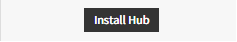
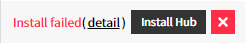
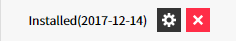
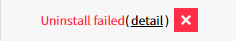

---
service : monitoring-dashboard 
title   : Monitoring Dashboard 
en : true
...

<!-- TOC -->

# Monitoring Dashboard

Monitoring Dashboard service requires CA UIM Hub and Robot installation for monitoring.
Monitoring Dashboard service allows you to install/uninstall the CA UIM Robot directly to the monitoring target instance.

--------------------------------------------------------------------------------

## Glossary

### CA UIM Monitoring Composition

![CA-UIM Architecture Diagram][md_auto_1_1]

### Hub
A hub is equipment used for proxy hub and gateway when a customer network has a restriction on external communication through a private network. The hub must communicate with the proxy hub through a public IP.
It is basically the same type as Robot, and additionally has Hub Probe.

### Robot

Robot is the term referring to Agent in CA UIM.
Robot controls the probe, collects data and sends it to the hub.
It checks the set thresholds when collecting data, and sends the alarm to the hub.

### Probe

CA UIM probe provides intelligence, which manages specific components of a managed device. For example, a common probe, the CDM probe, monitors CPU, disk, and memory usage on the target host. With more than 140 probes, the user can manage entire IT infrastructure including servers, network devices, applications and databases, as well as usage metering and data center power consumption.

#### Built-in Probes

+--------------+-----------------------------------+----------------------------------------------------------------------------------------------------------------------------------------------------------------------+
| Probe ID     | Probe Name                        | Description
+--------------+-----------------------------------+----------------------------------------------------------------------------------------------------------------------------------------------------------------------+
| cdm          | CPU, Disk, and Memory Performance | Monitors CPU, disk, and memory use.
+--------------+-----------------------------------+----------------------------------------------------------------------------------------------------------------------------------------------------------------------+
| processes    | Process Monitoring                | Monitors processes and windows owned by the processes to detect error situations. 
+--------------+-----------------------------------+----------------------------------------------------------------------------------------------------------------------------------------------------------------------+
| url_response | URL Endpoint Response Monitoring  | Monitors the page download time for a URL.
|              |                                   | The url_response probe can also perform comparison checks on the page-contents.
|              |                                   | The url_response probe supports proxies and user authentication.
|              |                                   | The probe also supports QoS (Quality of Service) messages, directed towards the CA UIM SLA (Service Level Agreement) family. 
+--------------+-----------------------------------+----------------------------------------------------------------------------------------------------------------------------------------------------------------------+
| net_connect  | Network Connectivity Monitoring   | Measures network connectivity based on ‘ping’ (ICMP ECHO) and TCP connections to a list of user-defined services. 
| net_traffic  | Network Traffic Analyzer          | Measures network bandwidth usage in terms of packets per second, and bytes per second.
|              |                                   | You can profile network usage by defining your own profiles containing criteria such as source, destination (host/network) addresses, and port/service information. 
+--------------+-----------------------------------+----------------------------------------------------------------------------------------------------------------------------------------------------------------------+

### Ansible
Ansible is a Provision &amp; Configuration Management Tool.
When installing hub and robot in Monitoring Dashboard, it is installed using Ansible.
An Ansible is installed on the customer's hub, and the robot is installed using Ansible installed on the customer's hub.

--------------------------------------------------------------------------------

## Installation Instructions and Precautions

### Open Firewall

To install hub and robot via Monitoring Dashboard, the following firewalls must be opened in advance.

1.  Infra Firewall
    AWS : Security Group settings
    AZURE : Network Security Group settings
    IDC : FireWall settings

2.  OS Firewall
    Windows will automatically open a firewall if you run a separate program.
    Linux should be opened manually if an OS firewall such as iptable is running.

[Download programs to open Windows firewall](./resource/port_open.zip)
[Download programs to close Windows firewall](./resource/port_close.zip)

#### Hub Firewall

+---------------------------------------------+------------------------+-------------+--------+------------------------------------------------------------------------------------------------------------------+
| Source                                      | Destination            | Port Range  | Action | Use
+=============================================+========================+=============+========+==================================================================================================================+
| Proxy Hub                                   | Customer Hub           | 22          | Permit | For Ansible
+---------------------------------------------+------------------------+-------------+--------+------------------------------------------------------------------------------------------------------------------+
| Proxy Hub                                   | Customer Hub           | 48000-48100 | Permit | Monitoring information exchange between proxy hub and customer hub and control of customer hub settings 
+---------------------------------------------+------------------------+-------------+--------+------------------------------------------------------------------------------------------------------------------+
| Any IP(Customer Robot Public IP/Private IP) | Customer Hub           | 48000-48010 | Permit | Monitoring information exchange between customer robot and customer hub 
+---------------------------------------------+------------------------+-------------+--------+------------------------------------------------------------------------------------------------------------------+
| Customer HubPublic IP                       | Customer HubPublic IP  | 48000-48100 | Permit | Public Cloud Environment, To communicate with public IP of Hub equipment when Hub is started in NAT environment 
+---------------------------------------------+------------------------+-------------+--------+------------------------------------------------------------------------------------------------------------------+
| Customer HubPrivate IP                      | Customer HubPrivate IP | 48000-48100 | Permit | Public Cloud Environment, To communicate with private IP of Hub equipment when Hub is started in NAT environment 
+---------------------------------------------+------------------------+-------------+--------+------------------------------------------------------------------------------------------------------------------+

#### Robot Firewall

+--------------------------+----------------+------------+--------+--------------------------------------------------------------------+
| Source                   | Destination    | Port Range | Action | Use
+==========================+================+============+========+====================================================================+
| Customer HuborPublic Hub | Customer Robot | 22         | Permit | For Ansible
+--------------------------+----------------+------------+--------+--------------------------------------------------------------------+
| Customer HuborPublic Hub | Customer Robot | 48000      | Permit | Monitoring information exchange and control of hub with the agent 
+--------------------------+----------------+------------+--------+--------------------------------------------------------------------+

#### Windows Firewall

+--------------------------+----------------+------------+--------+-------------------------------------------------------------------+
| Source                   | Destination    | Port Range | Action | Use
+==========================+================+============+========+===================================================================+
| Customer HuborPublic Hub | Customer Robot | 5985       | Permit | winrm service port for Ansible
+--------------------------+----------------+------------+--------+-------------------------------------------------------------------+
| Customer HuborPublic Hub | Customer Robot | 48000      | Permit | Monitoring information exchange and control of hub with the agent 
+--------------------------+----------------+------------+--------+-------------------------------------------------------------------+

--------------------------------------------------------------------------------

## Installation and Management of Hub

In order to use Monitoring Dashboard service in VPC environment, Hub installation that handles communication with Proxy Hub is required.
Hub requires public IP, and it is recommended to communicate with internal servers in VPC through private IP.

### Proxy Hub

The Proxy Hub is provided by the Monitoring Dashboard service.
A firewall must be opened for access from Proxy Hub to customer's hub.
Information of the Proxy Hub can be viewed from the Hub Management menu.
Hub type information is displayed as "Proxy", and it is currently composed of only one and we plan to expand it by region in the future.

![][md_auto_3_1]

### Public Hub

The Public Hub is provided by the Monitoring Dashboard service.
It is a common hub provided for customers who want to use without building a separate hub.
For customers monitoring a small number of servers, it is possible to connect to the Public Hub and monitor them without building a hub.
Hub type information is displayed as "public", and it is currently composed of only one unit and we plan to expand it by region in the future.

![][md_auto_3_2]

### Adding Hub

Add information about the server, which is to be used as a hub.
All names accept only uppercase English letters, numbers, -, _ characters.

1.  Proxy Hub : ProxyHub to connect with Hub
2.  Hub Name : Name of the Hub – MAX 35 characters
3.  Vendor : Infrastructure type(AWS/AZURE/IDC/input directly) – MAX 10 characters
4.  Region : Region information registered according to vendor – MAX 10 characters
5.  Public IP : used to communicate with Proxy Hub, used when Robot makes public connection.
6.  Private IP : Private IP –used when Robot makes private connection.
7.  Monitoring group : Monitoring group of the Hub

![][md_auto_3_3]

### Hub Installation

If you register the server information of the hub, you can proceed with the hub installation.
All names accept only uppercase English letters, numbers, -, _ characters.

1.  Proxy Hub : Information of the registered proxy hub (changeable)
2.  Hub Name : Name of the registered hub (changeable)
3.  Hub IP : Registered public IP (changeable)
4.  Connection port: SSH connection port (default: 22)
5.  Connection account : Server connection account
6.  Authentication method : Encryption key/password
7.  sudo or su : Select root authority settings (sudo/su/none)
8.  sudo or su password : NOPASSWD settings or password

![][md_auto_3_4]

The current status and setting features are available in the Hub's Status field.

+--------------------------------------+-----------------------------+
|  | - Hub installation          |
+--------------------------------------+-----------------------------+
|  | - Executing                 |
+--------------------------------------+-----------------------------+
|  | - install failure message   |
+--------------------------------------+-----------------------------+
|  | - Hub settings              |
+--------------------------------------+-----------------------------+
|  | - uninstall failure message |
+--------------------------------------+-----------------------------+

### Hub uninstall

Uninstall the hub robot which was installed in the hub
Access information is needed when uninstalling the Hub Robot. (Refer to Hub installation)

![][md_auto_3_5]

### Hub settings

Set threshold value of probe installed in the hub and set alarm’s On/Off. (Refer to 5. Robot setting)

### Robot using Hub

Check the information of the robot connected to the hub.

![][md_auto_3_7]

### Delete Hub

Delete the server information of the hub.
If you have a robot in use, you cannot delete it.

### Precautions for Installing and Deleting Hub

-   Public IP is required to communicate with the hub.
-   Remove hub robot and delete hub server information when deleting the hub
    -	Even if you delete only hub data, data will be collected normally.
    -	Hub setup requires a reinstallation process.

--------------------------------------------------------------------------------

## Robot Installation and Management

### Company Code Setting

Monitoring groups are managed with unique values throughout the Monitoring Dashboard service.
Each company needs a company code identifier setting to be used as the identifier of the monitoring group name.
The company code can only contain "2~8 letters, uppercase English letters, numbers, _, -" characters.
When changing the company code, all monitoring group names change, and it takes time to be reflected in CA UIM (within approx. 10 minutes).

![][md_auto_4_1_1]

If the CA UIM data is being changed or the company code is changed, the company code button will change to “Applying” and the company code cannot be modified until the changes are reflected in the CA UIM.

![][md_auto_4_1_2]

### Monitoring Group Settings

The Monitoring Dashboard service provides monitoring by monitoring group.
You can set up a monitoring group to expose to the Service Dashboard and the NOC Dashboard.

![][md_auto_4_2_1] 
![][md_auto_4_2_2]

#### Adding Monitoring Group

Add a monitoring group.
The monitoring group name may only contain "2~12 characters, uppercase English letters, numbers, _, -" characters.  

![][md_auto_4_2_3]

#### Modifying Monitoring Group

Modify the monitoring group name.
The monitoring group name may only contain "2~12 characters, uppercase English letters, numbers, _, -" characters.

When you modify a monitoring group name, all instances contained in the monitoring group will be changed.
If there is an instance where a robot is installed, it takes a certain time to reflect in CA UIM.

![][md_auto_4_2_4]

#### Deleting Monitoring Group

Delete a monitoring group.
![][md_auto_4_2_5] 

You cannot delete a monitoring group when there are instances contained in the monitoring group.  
![][md_auto_4_2_6]

#### Moving Monitoring Group

Move the instances contained in the monitoring group to another monitoring group.
When moving a monitoring group, if there is an instance where a robot is installed, it takes a certain time to reflect in CA UIM.

![][md_auto_4_2_7]

### PEM Management

Manage PEM files to conveniently use when installing Hub / Robot.
The saved content is encrypted and securely managed.

![][md_auto_4_3_1]

#### Adding PEM

You can register a PEM file or register it by entering it as TEXT.  
![][md_auto_4_3_2]

#### Modifying PEM

You can view and modify information of a registered PEM.

![][md_auto_4_3_3] 

#### Deleting PEM

You can delete information of a registered PEM.  
![][md_auto_4_3_4]

### Instance Management

Register the instance and modify the registered information.
![][md_auto_4_4_1]

#### Import via Asset Management

Search the instance list of the Asset to import easily 

![][md_auto_4_4_2]

Select the device to import and click the OK button to create an instance in MD.

1.  Items that have already been imported will not be displayed.
2.  If an instance with the same name already exists, it cannot be imported.

#### Registering Instances

Enter the instance information directly and register it.

![][md_auto_4_4_3] 

After entering the instance information, click the OK button to create an instance in MD.

#### Registering Multiple Instances

Register multiple instances simultaneously by uploading a CSV file with instance information.
Click Download Template to download a CSV file with a title of the input value.  

![][md_auto_4_4_4]

1.  NFRA_TYPE(required): The infrastructure type. (AWS, AZURE, IDC, input directly)
2.  NSTANCE_ID(required): The unique ID of the device
3.  OST_NAME(required): The name of the robot to be installed 
4.  EGION(required): Region code. You can view it on the Instance Direct Registration screen.
5.  RIVATE_IP: Enter Private IP. This is a required value if the use of public IP is set to N
6.  UBLIC_IP : Enter Public IP. This is a required value if the use of public IP is set to Y. 
7.  UBLIC_IP_YN(required): Enter whether to use Public IP. (Y/N)
8.  S_TYPE(required): Enter OS information of the device. (Windows/Linux)

#### Precautions for Deleting Instances
When deleting an instance, remove Robot and delete instance information

1.  Even if you delete only the instance data, data will be collected normally.
2.  Robot configuration requires a reinstallation process.

### Robot Installation and Management

Install the robot in the registered instance and manage the installed robot.

#### Installing Robot in Individual Instances

Install the robot in the registered instance.

1.  The first step is to enter the basic information of the robot to be installed.
    ![][md_auto_4_5_1]

    Enter the robot name, select Stage and Role, and click the Next button.
    Robot name is a required item.

2.  The second step is to enter the access information of the hub.
    ![][md_auto_4_5_2]

    Enter the access information of the hub device.
    The information entered is used only once, is securely encrypted, and is not stored.

3.  The third step is to enter the access information of the device where the robot will be installed.
Input items will change according to OS(Windows, Linux) information at the time of creating instance information.

    ![][md_auto_4_5_3]
    windows

    ![][md_auto_4_5_4]
    linux

    Click the OK button to install the robot in the instance.

#### Installing Robots in Multiple Instances

Install multiple robots simultaneously by uploading a CSV file with robot access information.
Click Download Template to download a CSV file with a title of the input value.
The template contains information about the instance where the robot is not installed.

![][md_auto_4_5_5]

1.  Required input items are different according to OS type.
2.  HOST_NAME(required): The name of the robot. It is pre-filled when downloading the template.
3.  HOST_IP(required): The IP of the connected device.
4.  PUBLIC_IP_YN(required): The value of whether a public IP is used.
5.  OS_TYPE(required): OS type (windows/linux)
6.  HUB_NAME(required): The name of the hub.
7.  STAGE : Enter Stage value.(PRD, STG, DEV, TEST)
8.  ROLE : Enter Role value.(WEB, WAS, API, DB, BATCH, FILE…)
9.  WIN_USER(windows required): The account for Windows access.
10. WIN_PASSWORD(windows required): The password for Windows access.
11. LNX_SSH_USER(linux required): The account for Linux access.
12. LNX_SSH_PASSWORD : The password for Linux access.
13. LNX_SSH_PORT(linux required): The Linux connection port.
14. LNX_KEY_TEXT : You can enter the contents of the private key directly.
15. LNX_PEM_NAME : You can use the saved PEM managed through the PEM Management menu.
16. LNX_BECOME_METHOD : Enter the root authority settings.(sudo/su)
17. LNX_BECOME_PASSWORD : Enter the required password when using sudo/su.
18. HUB_SSH_USER(required): The account for hub access.
19. HUB_SSH_PASSWORD : The password for hub access.
20. HUB_SSH_PORT(required): Hub connection port.
21. HUB_KEY_TEXT : You can directly input the private key contents for hub access.
22. HUB_PEM_NAME : You can use the saved PEM managed through the PEM Management menu.
23. HUB_BECOME_METHOD : Enter the root authority settings.(sudo/su)
24. HUB_BECOME_PASSWORD : Enter the required password when using sudo/su.

####  Deleting Multiple Robots

Delete multiple robots simultaneously by uploading a CSV file with robot access information.
Click Download Template to download a CSV file with a title of the input value.
The template contains information about the instance where the robot is installed.

![][md_auto_4_5_6]

1.  Required input items are different according to OS type.
2.  HOST_NAME(required): The name of the robot. It is pre-filled when downloading the template.
3.  OS_TYPE(required): OS type.(windows/linux)
4.  HUB_NAME(required): The name of the hub.
5.  WIN_USER(windows required): The account for Windows access.
6.  WIN_PASSWORD(windows required): The password for Windows access.
7.  LNX_SSH_USER(linux required): The account for Linux access.
8.  LNX_SSH_PASSWORD : The password for Linux access.
9.  LNX_SSH_PORT(linux required): The Linux connection port.
10. LNX_KEY_TEXT : You can enter the contents of the private key directly.
11. LNX_PEM_NAME : You can use the saved PEM managed through the PEM Management menu.
12. LNX_BECOME_METHOD : Enter the root authority settings.(sudo/su)
13. LNX_BECOME_PASSWORD : Enter the required password when using sudo/su.
14. HUB_SSH_USER(required): The account for hub access.
15. HUB_SSH_PASSWORD : The password for hub access.
16. HUB_SSH_PORT(required): Hub connection port.
17. HUB_KEY_TEXT : You can directly input the private key contents for hub access.
18. HUB_PEM_NAME : PEM You can use the saved PEM managed through the PEM Management menu.
19. HUB_BECOME_METHOD : Enter the root authority settings.(sudo/su)
20. HUB_BECOME_PASSWORD : Enter the required password when using sudo/su.

### Robot Settings

When a robot is installed, threshold values and alarm’s On/Off settings can be set for each probe installed in the robot.
The setting may be delayed if the name of the robot or the monitoring is changed or work is running on the hub connected to the robot.

#### cdm probe

You can check the minimum/average/maximum value of the latest 24-hour QoS data for each metric of the robot, and the threshold values and alarm’s On/Off can be set.

![][md_auto_4_6_1]

#### net_connect probe

You can register each service port you want to monitor and set alarm’s On/Off./p&gt;
![][md_auto_4_6_2]

#### processes probe

You can set the alarm’s On/Off when the process is down by registering the process pattern you want to monitor.
At the bottom, you can see the entire process list items that are currently running.

![][md_auto_4_6_3]

#### url_response probe

This probe is supported only by the hub robot and you can set the alarm’s On/Off by registering the URL you want to monitor.

![][md_auto_4_6_4]

--------------------------------------------------------------------------------

## Alarm Reception Settings

The alarm reception setting is available through the alarm service.

Alarm Service : [https://alarm.opsnow.com](https://alarm.opsnow.com)
[Alarm Manual](https://alarm.opsnow.com/docs/user_guide_alarm_en.html)

<!-- 이미지 모음 -->
[md_auto_1_1]: ./resource/md_auto_1_1.png
[md_auto_3_1]: ./resource/md_auto_3_1.png
[md_auto_3_2]: ./resource/md_auto_3_2.png
[md_auto_3_3]: ./resource/md_auto_3_3.png
[md_auto_3_4]: ./resource/md_auto_3_4.png
[md_auto_3_5]: ./resource/md_auto_3_5.png
[md_auto_3_7]: ./resource/md_auto_3_7.png
[md_auto_4_1_1]: ./resource/md_auto_4_1_1.png
[md_auto_4_1_2]: ./resource/md_auto_4_1_2.png
[md_auto_4_2_1]: ./resource/md_auto_4_2_1.png 
[md_auto_4_2_2]: ./resource/md_auto_4_2_2.png
[md_auto_4_2_3]: ./resource/md_auto_4_2_3.png
[md_auto_4_2_4]: ./resource/md_auto_4_2_4.png
[md_auto_4_2_5]: ./resource/md_auto_4_2_5.png 
[md_auto_4_2_6]: ./resource/md_auto_4_2_6.png
[md_auto_4_2_7]: ./resource/md_auto_4_2_7.png
[md_auto_4_3_1]: ./resource/md_auto_4_3_1.png
[md_auto_4_3_2]: ./resource/md_auto_4_3_2.png
[md_auto_4_3_3]: ./resource/md_auto_4_3_3.png 
[md_auto_4_3_4]: ./resource/md_auto_4_3_4.png
[md_auto_4_4_1]: ./resource/md_auto_4_4_1.png
[md_auto_4_4_2]: ./resource/md_auto_4_4_2.png
[md_auto_4_4_3]: ./resource/md_auto_4_4_3.png 
[md_auto_4_4_4]: ./resource/md_auto_4_4_4.png
[md_auto_4_5_1]: ./resource/md_auto_4_5_1.png
[md_auto_4_5_2]: ./resource/md_auto_4_5_2.png
[md_auto_4_5_3]: ./resource/md_auto_4_5_3.png
[md_auto_4_5_4]: ./resource/md_auto_4_5_4.png
[md_auto_4_5_5]: ./resource/md_auto_4_5_5.png
[md_auto_4_5_6]: ./resource/md_auto_4_5_6.png
[md_auto_4_6_1]: ./resource/md_auto_4_6_1.png
[md_auto_4_6_2]: ./resource/md_auto_4_6_2.png
[md_auto_4_6_3]: ./resource/md_auto_4_6_3.png
[md_auto_4_6_4]: ./resource/md_auto_4_6_4.png

