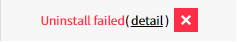

---
service : monitoring-dashboard 
title   : Monitoring Dashboard 
ko : true
...
<!-- TOC -->

# Monitoring Dashboard

Monitoring Dashboard 서비스에서는 모니터링을 위해 CA UIM 허브 및 로봇 설치가 필요합니다.
Monitoring Dashboard 서비스를 통해 직접 모니터링 대상 인스턴스에 CA UIM 로봇을 설치/삭제 하실 수 있습니다.

--------------------------------------------------------------------------------

## 용어 설명

### CA UIM 모니터링 구성

![][md_auto_1_1]
[CA-UIM Architecture Diagram]

### 허브

허브는 고객 네트워크가 사설 망으로 외부 통신에 제약이 있는 경우 Proxy 허브와 Gateway를 하는 장비이며, Proxy 허브와는 공인 IP로 통신이 되어야 합니다. 기본적으로 로봇과 동일한 형태이며, 추가적으로 허브 Probe를 가지고 있습니다.

### 로봇

로봇은 CA UIM에서 Agent를 지칭하는 용어입니다.
로봇은 Probe를 제어하고, 데이터를 수집하여 허브로 전송합니다.
데이터 수집 시 설정된 임계치를 확인하여, 알람을 허브로 전송합니다.

### Probe

CA UIM 프로브는 관리되는 장치의 특정 구성 요소를 관리하는 인텔리전스를 제공합니다. 예를 들어 하나의 공통 프로브 인 CDM 프로브는 대상 호스트에서 CPU, 디스크 및 메모리 사용을 모니터링합니다. 140 개 이상의 프로브가 제공되므로 사용자는 서버, 네트워크 장치, 애플리케이션 및 데이터베이스는 물론 사용량 측정 및 데이터 센터 전력 소비 등 전체 IT 인프라를 관리 할 수 있습니다

#### 기본 제공 Probes

+--------------+-----------------------------------+--------------------------------------------------------------------------------------------------------------------------------------------------------------------+
| Probe ID     | Probe Name                        | Description  
+==============+===================================+====================================================================================================================================================================+
| cdm          | CPU, Disk, and Memory Performance | Monitors CPU, disk, and memory use.  
+--------------+-----------------------------------+--------------------------------------------------------------------------------------------------------------------------------------------------------------------+
| processes    | Process Monitoring                | Monitors processes and windows owned by the processes to detect error situations. 
+--------------+-----------------------------------+--------------------------------------------------------------------------------------------------------------------------------------------------------------------+
| url_response | URL Endpoint Response Monitoring  | Monitors the page download time for a URL. 
|              |                                   | The url_response probe can also perform comparison checks on the page-contents.
|              |                                   | The url_response probe supports proxies and user authentication.
|              |                                   | The probe also supports QoS (Quality of Service) messages, directed towards the CA UIM SLA (Service Level Agreement) family. 
+--------------+-----------------------------------+--------------------------------------------------------------------------------------------------------------------------------------------------------------------+
| net_connect  | Network Connectivity Monitoring   | Measures network connectivity based on ‘ping’ (ICMP ECHO) and TCP connections to a list of user-defined services. 
+--------------+-----------------------------------+--------------------------------------------------------------------------------------------------------------------------------------------------------------------+
| net_traffic  | Network Traffic Analyzer          | Measures network bandwidth usage in terms of packets per second, and bytes per second.
|              |                                   |   You can profile network usage by defining your own profiles containing criteria such as source, destination (host/network) addresses, and port/service information. 
+--------------+-----------------------------------+--------------------------------------------------------------------------------------------------------------------------------------------------------------------+

### Ansible

Ansible은 Provision & Configuration Management Tool 입니다.
Monitoring Dashboard에서 허브와 로봇을 설치 시 Ansible을 사용하여 설치가 됩니다.
고객의 허브에는 Ansible이 설치되고, 고객 허브에 설치된 Ansible을 사용하여 로봇이 설치됩니다.

--------------------------------------------------------------------------------

## 설치 안내 및 주의 사항

### 방화벽 오픈

Monitoring Dashboard 통한 허브와 로봇설치를 위해서는 사전에 다음 방화벽이 오픈 되어야 합니다.

1.  Infra 방화벽
    AWS : Security Group 설정
    AZURE : Network Security Group 설정
    IDC : FireWall 설정

2.  OS 방화벽
    Windows는 별도의 프로그램을 실행할 경우 자동으로 방화벽이 오픈됩니다.
    Linux는 iptable등의 OS 방화벽이 실행되어 있는 경우, 수동으로 열어야 합니다.

3.  [Windows 방화벽 열기 프로그램 다운받기](./resource/port_open.zip)
4.  [Windows 방화벽 닫기 프로그램 다운받기](./resource/port_close.zip)

#### 허브 방화벽

+----------------------------------+--------------------+-------------+--------+---------------------------------------------------------------------------------+
| Source                           | Destination        | Port Range  | Action | 용도  
+==================================+====================+=============+========+=================================================================================+
| Proxy 허브                       | 고객사 허브        | 22          | Permit | For Ansible  
+----------------------------------+--------------------+-------------+--------+---------------------------------------------------------------------------------+
| Proxy 허브                       | 고객사 허브        | 48000-48100 | Permit | Proxy 허브와 고객 허브 간 모니터링 정보 교환 및 고객사 허브 설정 컨트롤 
+----------------------------------+--------------------+-------------+--------+---------------------------------------------------------------------------------+
| Any IP(고객사 로봇공인IP/사설IP) | 고객사 허브        | 48000-48010 | Permit | 고객사 로봇 과 고객사 허브 간 모니터링 정보 교환  
+----------------------------------+--------------------+-------------+--------+---------------------------------------------------------------------------------+
| 고객사 허브공인 IP               | 고객사 허브공인 IP | 48000-48100 | Permit | Public Cloud 환경, NAT 환경에서의 허브 기동 시 허브 장비의 공인 IP와 통신을 위함 
+----------------------------------+--------------------+-------------+--------+---------------------------------------------------------------------------------+
| 고객사 허브사설 IP               | 고객사 허브사설 IP | 48000-48100 | Permit | Public Cloud 환경, NAT 환경에서의 허브 기동 시 허브 장비의 사설 IP와 통신을 위함 
+----------------------------------+--------------------+-------------+--------+---------------------------------------------------------------------------------+

#### 로봇 방화벽

+--------------------------+-------------+------------+--------+----------------------------------------------+
| Source                   | Destination | Port Range | Action | 용도  
+==========================+=============+============+========+==============================================+
| 고객사 허브orPublic 허브 | 고객사 로봇 | 22         | Permit | For Ansible  
+--------------------------+-------------+------------+--------+----------------------------------------------+
| 고객사 허브orPublic 허브 | 고객사 로봇 | 48000      | Permit | 허브가 Agent 와 모니터링 정보 교환 및 컨트롤 
+--------------------------+-------------+------------+--------+----------------------------------------------+

#### Windows 방화벽

+--------------------------+-------------+------------+--------+----------------------------------------------+
| Source                   | Destination | Port Range | Action | 용도  
+==========================+=============+============+========+==============================================+
| 고객사 허브orPublic 허브 | 고객사 로봇 | 5985       | Permit | winrm service port for Ansible  
+--------------------------+-------------+------------+--------+----------------------------------------------+
| 고객사 허브orPublic 허브 | 고객사 로봇 | 48000      | Permit | 허브가 Agent 와 모니터링 정보 교환 및 컨트롤 
+--------------------------+-------------+------------+--------+----------------------------------------------+

--------------------------------------------------------------------------------

## 허브 설치 및 관리
VPC환경에서 Monitoring Dashboard 서비스 이용을 위해서 Proxy 허브와 통신을 처리하는 허브 설치가 필요합니다.
허브는 Public IP가 필요하며, VPC내의 내부 서버들과는 Private IP로 통신하는 구성을 권장합니다.

### Proxy 허브

Proxy 허브는 Monitoring Dashboard 서비스에서 제공합니다.
Proxy 허브에서 고객사 허브로의 접근을 위한 방화벽 오픈이 필요합니다.
Proxy 허브의 정보는 허브 관리 메뉴에서 확인 가능합니다.
허브 타입 정보는 “Proxy”로 표시되고, 현재는 1대만 구성되어 있으며 향후 지역 별로 확장해 나갈 계획입니다.

![][md_auto_3_1]

### Public 허브

Public 허브는 Monitoring Dashboard 서비스에서 제공합니다.
별도의 허브 구축 없이 사용하고자 하는 고객사에게 제공하는 공용 허브입니다.
소량의 서버를 모니터링을 하는 고객의 경우, Public 허브를 연결하여 허브 구축없이 바로 모니터링이 가능합니다.
허브 타입 정보는 “public”으로 표시되고, 현재는 1대만 구성되어 있으며 향후 지역 별로 확장해 나갈 계획입니다

![][md_auto_3_2]

### 허브 추가

허브로 사용할 서버의 정보를 추가합니다.
모든 명칭은 영문 대문자, 숫자, -, _ 문자만 허용합니다.

1.  Proxy Hub : Hub와 연결할 ProxyHub
2.  Hub Name : Hub의 이름 – MAX 35자
3.  Vendor : 인프라 유형(AWS/AZURE/IDC/직접입력) – MAX 10자
4.  Region : Vendor에 따라 등록된 Region정보 – MAX 10자
5.  Public IP : 공인 IP - Proxy Hub와 통신 시 사용, 로봇이 Public 연결을 할 경우 사용
6.  Private IP : 사설 IP – 로봇 연결을 Private으로 할 경우 사용
7.  모니터링 그룹 : 허브의 모니터링 그룹 

![][md_auto_3_3]

### 허브 설치

Hub의 서버 정보를 등록하면, 허브 설치를 진행할 수 있습니다.
모든 명칭은 영문 대문자, 숫자, -, _ 문자만 허용합니다.

1.  Proxy Hub : 등록한 proxy hub 정보 (변경 가능)
2.  Hub Name : 등록한 hub 이름 (변경 가능)
3.  Hub IP : 등록한 public ip (변경 가능)
4.  접속 포트: SSH 접속 포트 (default: 22)
5.  접속 계정 : 서버 접속 계정
6.  인증 방법 : 암호화키/비밀번호
7.  sudo or su : root 권한 설정 선택 (sudo/su/없음)
8.  sudo or su password : NOPASSWD 설정 혹은 패스워드

![][md_auto_3_4]

Hub의 상태 필드에서 현재 상태 및 설정 기능을 사용할 수 있다.

+-----------------------------------------------------------------------------+---------------------------+
|  | - 허브 설치  
+-----------------------------------------------------------------------------+---------------------------+
|  | - 설치중  
+-----------------------------------------------------------------------------+---------------------------+
|  | - 설치 실패 메시지 확인 
+-----------------------------------------------------------------------------+---------------------------+
|  | - 허브 설정  
+-----------------------------------------------------------------------------+---------------------------+
|  | - 제거 실패 메시지 확인 
+-----------------------------------------------------------------------------+---------------------------+

### 허브 제거
Hub에 설치된 Hub 로봇을 제거한다.
Hub 로봇 제거 시에도 접속 정보가 필요하다. (내용은 Hub 설치 참조)

![][md_auto_3_5]

### 허브 설정
Hub에 설치된 Probe의 임계치와 알람 On/Off를 설정한다. (로봇 설정 항목 참조)

### 허브를 사용중인 로봇
Hub에 연결된 로봇의 정보를 확인한다.

![][md_auto_3_7]

### 허브 삭제
Hub의 서버 정보를 삭제한다.
사용중인 로봇이 있는 경우에는 삭제가 불가능합니다.

### 허브 설치 및 삭제 시 주의 사항

-   허브와 통신 하기 위해서는 Public IP가 필요합니다.
-   Hub 삭제 시 Hub 로봇을 제거하고 Hub 서버 정보를 삭제 하십시요
    -	Hub 데이터만 삭제 시에도 데이터는 정상 수집됩니다.
    -	Hub 설정을 위해서는 재설치 과정이 필요합니다.

--------------------------------------------------------------------------------

## 로봇 설치 및 관리 

### 회사 코드 설정

모니터링 그룹은 Monitoring Dashboard 서비스 전체에서 유일한 값으로 관리됩니다.
회사마다 모니터링 그룹명의 식별자로 사용할 회사 코드 식별자 설정이 필요합니다.
회사 코드는 “2~8글자, 영문대문자, 숫자, _, -“ 문자만 사용 가능합니다.
회사 코드 변경 시 모든 모니터링 그룹명 변경이 발생하고, CA UIM에 반영되기 까지 시간이 소요됩니다.(약 10분 이내)

![][md_auto_4_1_1]

CA UIM 데이터가 변경 중이거나 회사 코드를 변경 하면 CA UIM에 반영되기 까지 회사 코드 버튼은 적용 중으로 변경되고 회사 코드를 수정할 수 없습니다.

![][md_auto_4_1_2]

### 모니터링 그룹 설정

Monitoring Dashboard 서비스는 모니터링 그룹 별로 모니터링을 제공합니다.
Service Dashboard와 NOC Dashboard에 노출할 모니터링 그룹을 설정할 수 있습니다.

![][md_auto_4_2_1] 
![][md_auto_4_2_2]

#### 모니터링 그룹 추가

모니터링 그룹을 추가 합니다.
모니터링 그룹 명은 “2~12글자, 영문대문자, 숫자, _, -“ 문자만 사용 가능합니다.

![][md_auto_4_2_3]

#### 모니터링 그룹 수정

모니터링 그룹 이름을 수정합니다.
모니터링 그룹 명은 “2~12글자, 영문대문자, 숫자, _, -“ 문자만 사용 가능합니다.

모니터링 그룹 명 수정 시 해당 모니터링 그룹에 포함된 인스턴스는 모두 변경됩니다.
로봇이 설치된 인스턴스가 존재하는 경우에는, CA UIM 반영까지 일정 시간이 소요됩니다.

![][md_auto_4_2_4]

#### 모니터링 그룹 삭제

모니터링 그룹을 삭제 합니다.

![][md_auto_4_2_5]

모니터링 그룹에 포함된 인스턴스가 있을 때에는 삭제가 불가능 합니다.

![][md_auto_4_2_6]

#### 모니터링 그룹 이동

모니터링 그룹에 포함된 인스턴스를 다른 모니터링 그룹으로 이동합니다.
모니터링 그룹 이동 시에 로봇이 설치된 인스턴스가 존재하는 경우에는, CA UIM 반영까지 일정 시간이 소요됩니다.

![][md_auto_4_2_7]

### PEM 관리

PEM 파일을 관리하여, Hub / 로봇 설치 시 편리하게 사용이 가능합니다.
저장한 내용은 암호화되어 안전하게 관리됩니다.

![][md_auto_4_3_1]

#### PEM 추가

PEM 파일을 등록할 수도 있고 TEXT로 입력하여 등록할 수 있습니다.  

![][md_auto_4_3_2]

#### PEM 수정

등록한 PEM 정보를 확인하고 수정할 수 있습니다.

![][md_auto_4_3_3]

#### PEM 삭제

등록한 PEM 정보를 삭제할 수 있습니다.

![][md_auto_4_3_4]

### 인스턴스 관리

인스턴스를 등록하고 등록된 정보를 수정 합니다.

![][md_auto_4_4_1]

#### Asset Management를 통해 가져오기

Asset의 인스턴스 목록을 조회하여 간편하게 가져옵니다.

![][md_auto_4_4_2]

가져올 장비를 선택 하고 확인 버튼을 클릭 하면 MD에 인스턴스가 생성 됩니다.

1.  이미 가져온 항목은 표시 되지 않습니다.
2.  이름이 같은 인스턴스가 이미 존재 할 경우 가져오기 할 수 없습니다.

#### 인스턴스 직접 등록하기

인스턴스 정보를 직접 입력 하여 등록 합니다.

![][md_auto_4_4_3]

인스턴스 정보 입력 후 확인 버튼을 클릭 하면 MD에 인스턴스가 생성 됩니다.

#### 복수의 인스턴스 등록하기

인스턴스 정보가 입력된 CSV 파일을 업로드 하여 다수의 인스턴스를 동시에 등록 합니다.
템플릿 다운로드를 클릭 하면 입력 값에 대한 제목이 설정된 CSV파일을 내려 받을 수 있습니다.

![][md_auto_4_4_4]

1.  INFRA_TYPE(필수): 인프라 종류 입니다.(AWS, AZURE, IDC, 직접 입력)
2.  INSTANCE_ID(필수): 장비의 고유 ID 입니다.
3.  HOST_NAME(필수): 설치될 로봇 이름으로 사용 됩니다.
4.  REGION(필수): 지역 코드 입니다. 인스턴스 직접 등록 화면에서 조회해 볼 수 있습니다.
5.  PRIVATE_IP: 사설 IP를 입력 합니다. 공인 IP 사용 여부가 N일경우 필수 값 입니다.
6.  PUBLIC_IP : 공인 IP를 입력 합니다. 공인 IP 사용 여부가 Y일경우 필수 값 입니다.
7.  PUBLIC_IP_YN(필수): 공인 IP 사용 여부를 입력 합니다.(Y/N)
8.  OS_TYPE(필수): 장비의 OS 정보를 입력 합니다.(windows/linux)

#### 인스턴스 삭제 시 주의 사항

인스턴스 삭제 시 로봇을 제거하고 인스턴스 정보를 삭제 하십시요

1.  인스턴스 데이터만 삭제 시에도 데이터는 정상 수집됩니다.
2.  로봇 설정을 위해서는 재설치 과정이 필요합니다.

### 로봇 설치 및 관리

등록된 인스턴스에 로봇을 설치 하고 설치된 로봇을 관리 합니다.

#### 개별 인스턴스에 로봇 설치

등록된 인스턴스에 로봇을 설치 합니다.

1.  설치될 로봇의 기본 정보를 입력 합니다.
    ![][md_auto_4_5_1]

    로봇 명을 입력 하고 Stage와 Role을 선택 후 다음 버튼을 클릭 합니다.
    로봇 이름은 필수 항목 입니다.

2.  허브의 접속 정보를 입력 합니다.
    ![][md_auto_4_5_2]

    허브 장비의 접속 정보를 입력 합니다.
    입력된 정보는 1회만 사용되고 안전하게 암호화 되어 사용되며, 저장되지 않습니다.

3.  로봇을 설치할 장비의 접속 정보를 입력 합니다.
    인스턴스 정보 생성 시점의 OS(windows, linux) 정보에 따라 입력 항목이 달라 집니다.

    ![][md_auto_4_5_3]
    windows

    ![][md_auto_4_5_4]
    linux

확인 버튼을 클릭 하면 인스턴스에 로봇이 설치 됩니다.

#### 복수의 인스턴스에 로봇 설치

로봇 접속 정보가 입력된 CSV 파일을 업로드 하여 다수의 로봇을 동시에 설치 합니다.
템플릿 다운로드를 클릭 하면 입력 값에 대한 제목이 설정된 CSV파일을 내려 받을 수 있습니다.
템플릿은 로봇이 설치 되지 않은 인스턴스 정보를 포함 합니다.

![][md_auto_4_5_5]

1.  OS 종류에 따라 필수 입력 항목이 달라 집니다.
2.  HOST_NAME(필수): 로봇 이름 입니다. 템플릿 다운로드 시 미리 입력 되어 있습니다.
3.  HOST_IP(필수): 접속 장비의 IP 입니다.
4.  PUBLIC_IP_YN(필수): 공인 IP 사용 여부 값 입니다.
5.  OS_TYPE(필수): OS 종류 입니다.(windows/linux)
6.  HUB_NAME(필수): 허브의 이름 입니다.
7.  STAGE : Stage 값을 입력 합니다.(PRD, STG, DEV, TEST)
8.  ROLE : Role값을 입력 합니다.(WEB, WAS, API, DB, BATCH, FILE…)
9.  WIN_USER(windows 필수): windows 접속 계정 입니다.
10.  WIN_PASSWORD(windows 필수): windows 접속 비밀번호 입니다.
11.  LNX_SSH_USER(linux 필수): linux 접속 계정 입니다.
12.  LNX_SSH_PASSWORD : linux 접속 비밀번호 입니다.
13.  LNX_SSH_PORT(linux 필수): linux 접속 포트 입니다.
14.  LNX_KEY_TEXT : 개인 키 내용을 직접 입력 할 수 있습니다.
15.  LNX_PEM_NAME : PEM 관리 메뉴를 통해 관리 되는 저장된 PEM을 사용 할 수 있습니다.
16.  LNX_BECOME_METHOD : root 권한 설정을 입력 합니다.(sudo/su)
17.  LNX_BECOME_PASSWORD : sudo/su 사용시 필요한 비밀번호를 입력 합니다.
18.  HUB_SSH_USER(필수): 허브 접속 계정 입니다.
19.  HUB_SSH_PASSWORD : 허브 접속 비밀번호 입니다.
20.  HUB_SSH_PORT(필수): 허브 접속 포트 입니다.
21.  HUB_KEY_TEXT : 허브 접속용 개인 키 내용을 직접 입력 할 수 있습니다.
22.  HUB_PEM_NAME : PEM 관리 메뉴를 통해 관리 되는 저장된 PEM을 사용 할 수 있습니다.
23.  HUB_BECOME_METHOD : root 권한 설정을 입력 합니다.(sudo/su)
24.  HUB_BECOME_PASSWORD : sudo/su 사용시 필요한 비밀번호를 입력 합니다.

#### 복수의 로봇 삭제

로봇 접속 정보가 입력된 CSV 파일을 업로드 하여 다수의 로봇을 동시에 제거 합니다.
템플릿 다운로드를 클릭 하면 입력 값에 대한 제목이 설정된 CSV파일을 내려 받을 수 있습니다.
템플릿은 로봇이 설치 된 인스턴스 정보를 포함 합니다.

![][md_auto_4_5_6]

1.  OS 종류에 따라 필수 입력 항목이 달라 집니다.
2.  HOST_NAME(필수): 로봇 이름 입니다. 템플릿 다운로드 시 미리 입력 되어 있습니다.
3.  OS_TYPE(필수): OS 종류 입니다.(windows/linux)
4.  HUB_NAME(필수): 허브의 이름 입니다.
5.  WIN_USER(windows 필수): windows 접속 계정 입니다.
6.  WIN_PASSWORD(windows 필수): windows 접속 비밀번호 입니다.
7.  LNX_SSH_USER(linux 필수): linux 접속 계정 입니다.
8.  LNX_SSH_PASSWORD : linux 접속 비밀번호 입니다.
9.  LNX_SSH_PORT(linux 필수): linux 접속 포트 입니다.
10. LNX_KEY_TEXT : 개인 키 내용을 직접 입력 할 수 있습니다.
11. LNX_PEM_NAME : PEM 관리 메뉴를 통해 관리 되는 저장된 PEM을 사용 할 수 있습니다.
12. LNX_BECOME_METHOD : root 권한 설정을 입력 합니다.(sudo/su)
13. LNX_BECOME_PASSWORD : sudo/su 사용시 필요한 비밀번호를 입력 합니다.
14. HUB_SSH_USER(필수): 허브 접속 계정 입니다.
15. HUB_SSH_PASSWORD : 허브 접속 비밀번호 입니다.
16. HUB_SSH_PORT(필수): 허브 접속 포트 입니다.
17. HUB_KEY_TEXT : 허브 접속용 개인 키 내용을 직접 입력 할 수 있습니다.
18. HUB_PEM_NAME : PEM 관리 메뉴를 통해 관리 되는 저장된 PEM을 사용 할 수 있습니다.
19. HUB_BECOME_METHOD : root 권한 설정을 입력 합니다.(sudo/su)
20. HUB_BECOME_PASSWORD : sudo/su 사용시 필요한 비밀번호를 입력 합니다.

### 로봇 설정

로봇이 설치된 경우, 해당 로봇에 설치된 Probe 별로 임계치 및 알람 On/Off 설정을 할 수 있다.
로봇의 이름이나 모니터링 변경 혹은 로봇과 연결된 허브에 작업이 동작 중인 경우, 설정이 잠시 지연될 수 있음.

#### cdm probe

로봇의 메트릭별 최근 24시간 QoS 데이터의 최소/평균/최대 값을 확인할 수 있고 임계치 및 알람 On/Off 를 설정할 수 있다.  

![][md_auto_4_6_1]

#### net_connect probe

모니터링 하려는 각 서비스 포트를 등록하고 알람 On/Off 를 설정할 수 있다.

![][md_auto_4_6_2]

#### processes probe

모니터링 하려는 프로세스 페턴을 등록하여 해당 프로세스가 DOWN 되었을 때 알람 On/Off 를 설정할 수 있다.
하단에서는 현제 구동 중인 전체 processes list 항목을 볼 수 있다.

![][md_auto_4_6_3]

#### url_response probe

Hub 로봇에서만 지원하고 있는 probe이며 모니터링할 url을 등록하여 알람 On/Off 를 설정할 수 있다.

![][md_auto_4_6_4]

--------------------------------------------------------------------------------

## 알람 수신 설정

알람 수신 설정은 알람 서비스를 통해서 가능합니다.

알람 서비스 : [https://alarm.opsnow.com](https://alarm.opsnow.com)
[알람 메뉴얼](https://alarm.opsnow.com/docs/user_guide_alarm_KO.html)

<!-- 이미지 모음 -->
[md_auto_1_1]: ./resource/md_auto_1_1.png
[md_auto_3_1]: ./resource/md_auto_3_1.png
[md_auto_3_2]: ./resource/md_auto_3_2.png
[md_auto_3_3]: ./resource/md_auto_3_3.png
[md_auto_3_4]: ./resource/md_auto_3_4.png
[md_auto_3_5]: ./resource/md_auto_3_5.png
[md_auto_3_7]: ./resource/md_auto_3_7.png
[md_auto_4_1_1]: ./resource/md_auto_4_1_1.png
[md_auto_4_1_2]: ./resource/md_auto_4_1_2.png
[md_auto_4_2_1]: ./resource/md_auto_4_2_1.png 
[md_auto_4_2_2]: ./resource/md_auto_4_2_2.png
[md_auto_4_2_3]: ./resource/md_auto_4_2_3.png
[md_auto_4_2_4]: ./resource/md_auto_4_2_4.png
[md_auto_4_2_5]: ./resource/md_auto_4_2_5.png
[md_auto_4_2_6]: ./resource/md_auto_4_2_6.png
[md_auto_4_2_7]: ./resource/md_auto_4_2_7.png
[md_auto_4_3_1]: ./resource/md_auto_4_3_1.png
[md_auto_4_3_2]: ./resource/md_auto_4_3_2.png
[md_auto_4_3_3]: ./resource/md_auto_4_3_3.png
[md_auto_4_3_4]: ./resource/md_auto_4_3_4.png
[md_auto_4_4_1]: ./resource/md_auto_4_4_1.png
[md_auto_4_4_2]: ./resource/md_auto_4_4_2.png
[md_auto_4_4_3]: ./resource/md_auto_4_4_3.png
[md_auto_4_4_4]: ./resource/md_auto_4_4_4.png
[md_auto_4_5_1]: ./resource/md_auto_4_5_1.png
[md_auto_4_5_2]: ./resource/md_auto_4_5_2.png
[md_auto_4_5_3]: ./resource/md_auto_4_5_3.png
[md_auto_4_5_4]: ./resource/md_auto_4_5_4.png
[md_auto_4_5_5]: ./resource/md_auto_4_5_5.png
[md_auto_4_5_6]: ./resource/md_auto_4_5_6.png
[md_auto_4_6_1]: ./resource/md_auto_4_6_1.png
[md_auto_4_6_2]: ./resource/md_auto_4_6_2.png
[md_auto_4_6_3]: ./resource/md_auto_4_6_3.png
[md_auto_4_6_4]: ./resource/md_auto_4_6_4.png

