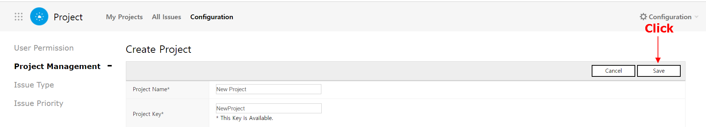
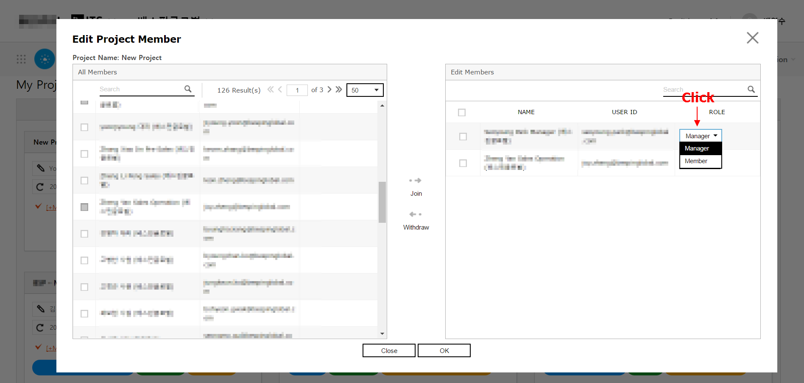
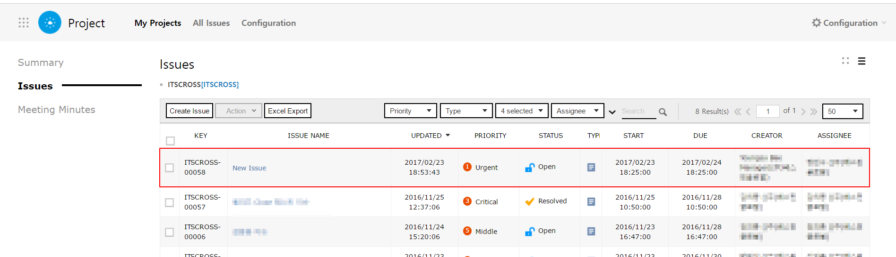

#   Project

프로젝트 혹은 팀 별로 업무를 등록하고 등록된 업무의 이력을 관리할 수 있습니다.

##  프로젝트/팀 별 업무 관리
Project Service를 통한 프로젝트/팀 별 업무 관리 방법을 설명합니다.

## 프로젝트/팀 생성
프로젝트, 팀을 생성하고 구성원을 추가합니다.

### 프로젝트, 팀 생성

>   Project - Configuration - *Project Managmenet*

새로운 프로젝트, 팀을 생성합니다.

1.  [Create Project] 버튼을 클릭합니다.
    

2.  "Create Project" 화면에서 프로젝트, 팀 정보를 입력합니다.
    

    | No   | Name           | Required | Description                                                  |
    | ---- | -------------- | -------- | ------------------------------------------------------------ |
    | ①    | Project Name   | Required | 새롭게 생성할 프로젝트, 팀의 이름을 입력합니다.              |
    | ②    | Project key    | Required | 프로젝트, 팀을 식별하기 위한 고유 코드를 입력합니다.20자 이내의 영문, 숫자, 특수문자 `.`, `-`, `_` 만 입력 가능합니다. |
    | ③    | Project Leader | Required | 프로젝트, 팀의 관리자를 지정할 수 있습니다. [Search] 버튼 클릭 시 "Search Leader" 팝업이 표시되며 추가할 프로젝트, 팀의 관리자로 지정할 사용자를 선택할 수 있습니다.복수의 사용자를 관리자로 지정할 수는 없습니다. |
    | ④    | Issue Type     | .        | 프로젝트, 팀에서 수행되는 업무의 종류를 선택할 수 있습니다.[Search] 버튼 클릭 시 "Issue Type" 팝업이 표시되며, 이 목록에서 수행할 업무를 선택할 수 있습니다. |
    | ⑤    | Start Date     | Required | 프로젝트의 시작 날짜를 선택할 수 있습니다.기본값으로 현재 날짜가 표시되며, [캘린더] 버튼을 클릭해 표시되는 캘린더에서 날짜를 변경할 수 있습니다. |
    | ⑥    | Release Date   | .        | 프로젝트 종료일을 선택할 수 있습니다.기본값으로 현재 날짜가 표시되며, [캘린더] 버튼을 클릭해 표시되는 캘린더에서 날짜를 변경할 수 있습니다. |
    | ⑦    | URL            | .        | 프로젝트가 서비스되고 있는 URL을 입력할 수 있습니다.         |
    | ⑧    | Description    | .        | 생성할 프로젝트, 팀에 대한 설명을 입력합니다.텍스트 편집기를 통해 자유롭게 입력할 수 있습니다. |

3.  [Save] 버튼을 클릭합니다.
    

4.  "My Project" 메뉴를 클릭해 프로젝트 목록 화면으로 이동합니다. 프로젝트 목록 화면에서 새로운 프로젝트가 추가되었음을 확인할 수 있습니다.
    

### 구성원 편집

>   Project - Configuration - *Project Managmenet*

새롭게 생성된 프로젝트, 팀에 함께 업무를 진행할 구성원을 추가합니다. 이미 추가된 프로젝트, 팀의 구성원을 변경합니다.

1.  프로젝트 목록에서 구성원을 추가/편집할 프로젝트의 [Edit Member] 버튼을 클릭합니다.
    
    왼쪽 목록에 전체 사용자가, 오른쪽 목록에 현재 프로젝트, 팀에 추가된 사용자가 표시됩니다. 해당 프로젝트, 팀의 구성원을 왼쪽 목록에서 선택해 오른쪽 목록에 추가합니다.
    

2.  오른쪽 목록에 추가한 구성원의 권한을 설정합니다.
    

    [OK] 버튼을 클릭해 변경 내용을 저장합니다. 프로젝트 목록에서 프로젝트의 구성원이 추가되었음을 확인할 수 있습니다.
    

###	1.3 업무 종류 설정

>   Project - Configuration - *Issue Type*
업무의 종류별 구분을 위한 'Issue Type'을 설정할 수 있습니다.

1.  "Issue Type" 메뉴에서 현재 추가된 Issue Type의 목록을 확인할 수 있습니다.
    

2.  "Issue Type" 화면에서 [Create Issue Type] 버튼을 클릭합니다.
    

3.  "Create Issue Type" 팝업이 표시되며, 추가할 Issue Type 의 정보를 입력할 수 있습니다.
    

    | No   | Name            | Required | Description                                                  |
    | ---- | --------------- | -------- | ------------------------------------------------------------ |
    | ①    | Issue Type Code | Required | 새롭게 생성할 Issue Type을 식별하기 위한 고유 코드를 입력합니다. |
    | ②    | Issue Type Name | Required | Issue Type의 이름을 입력합니다.여기에 입력된 내용이 업무의 이름으로 표시됩니다. |
    | ③    | Order           | Required | Issue Type 목록에서 표시될 순서를 지정할 수 있습니다. 숫자만 입력 가능합니다. |
    | ④    | Description     | .        | Issue Type에 대한 설명을 입력할 수 있습니다.                 |
    | ⑤    | Icon            | Required | Issue Type 목록에 표시될 아이콘을 업로드 할 수 있습니다.     |                        

4.  [OK] 버튼을 클릭하면 팝업이 종료됩니다. Issue Type 목록을 통해 새로운 Issue Type이 추가되었음을 알 수 있습니다.
    

###	1.4 업무 우선순위 설정
>   Project - Configuration - *Issue Priority*

업무의 우선 순위를 표시하며, 처리 기한을 설정할 수 있는 Issue Priority를 설정할 수 있습니다.

1.  "Issue Priority" 메뉴를 클릭해 현재 설정된 Issue Priority 목록을 확인할 수 있습니다.
    

2.  "Issue Priority" 화면에서 [Create New Priority] 버튼을 클릭합니다.
    

3.  "Create Issue Priority" 화면에서 새롭게 추가할 Issue Priority의 정보를 입력합니다.
    

    | No   | Name                | Required | Description                                                  |
    | ---- | ------------------- | -------- | ------------------------------------------------------------ |
    | ①    | Issue Priority Code | Required | 새롭게 생성할 Issue Priority을 식별하기 위한 고유 코드를 입력합니다. |
    | ②    | Issue Priority Name | Required | Issue Priority의 이름을 입력합니다.여기에 입력된 내용이 Issue Priority의 이름으로 표시됩니다. |
    | ③    | Order               | Required | Issue Priority 목록에서 표시될 순서를 지정할 수 있습니다.숫자만 입력 가능합니다. |
    | ④    | Term (Unit:day)     | Required | Issue Priority의 처리 기한을 입력할 수 있습니다.숫자만 입력 가능합니다.업무 생성 후 Issue Priority 선택 시 시작일로부터 여기에 입력된 값이 자동으로 계산되어 완료일로 표시됩니다. |
    | ⑤    | Description         | .        | Issue Priority에 대한 설명을 입력할 수 있습니다.             |

4.  [OK] 버튼을 클릭하면 팝업이 종료됩니다. Issue Priority 목록을 통해 새로운 Issue Priority이 추가되었음을 알 수 있습니다.
    

5.  새 업무 등록 혹은 기존 업무 편집 시, 추가한 Issue Priority를 사용할 수 있습니다. 업무 등록 및 편집은 새로운 업무 등록 항목을 참고해 주세요.
    

###	2. 업무 등록 및 진행 상황 관리

새로운 업무를 등록하고, 등록된 업무의 진행 상황을 관리할 수 있습니다. 이를 통해 프로젝트/팀 내 업무의 진행 상황을 파악할 수 있습니다.

###	2.1 새로운 업무 등록

>   Project

새로운 업무를 등록합니다.

1.  프로젝트/팀 목록에서 업무를 등록할 프로젝트/팀을 클릭합니다.
    

2.  좌측 메뉴 중 "Issues" 메뉴를 클릭해 업무 목록으로 이동합니다.
    

3.  "Issues" 화면에서 [Create Issue] 버튼을 클릭합니다.
    

4.  "Create Issues" 화면에서 생성할 업무의 정보를 입력합니다.
    

    | No   | Name                    | Required | Description                                                  |
    | ---- | ----------------------- | -------- | ------------------------------------------------------------ |
    | ①    | Project                 | Required | 업무를 등록할 프로젝트/팀을 선택할 수 있습니다.선택한 프로젝트가 기본값으로 선택되어 있으며, 드롭다운 메뉴 클릭 시 생성된 프로젝트/팀이 드롭다운 목록으로 표시됩니다. |
    | ②    | Issue Title             | Required | 등록할 업무의 이름을 입력합니다.                             |
    | ③    | Issue Type              | Required | 업무의 종류를 선택할 수 있습니다. 드롭다운 메뉴 클릭 시 사전에 등록된 Issue Type들이 드롭다운 목록으로 표시됩니다. |
    | ④    | Assignee                | Required | 업무의 담당자를 선택할 수 있습니다.[Search] 버튼을 클릭해 담당자를 선택할 수 있으며, 한 업무당 한명의 사용자만을 등록할 수 있습니다. |
    | ⑤    | Priority                | Required | 업무의 우선 순위를 선택할 수 있습니다.드롭다운 메뉴 클릭 시 사전에 등록된 Issue Prioty들이 드롭다운 목록으로 표시됩니다. |
    | ⑥    | Start Date              | Required | 업무의 시작 일/시/분을 선택할 수 있습니다.기본값으로 현재 날짜가 표시됩니다. |
    | ⑦    | Due Date                | Required | 업무의 완료일을 선택할 수 있습니다.기본값으로 시작일로부터 선택한 Issue Priority에 설정된 기간이 지난 날짜가 표시됩니다. |
    | ⑧    | Estimate Time           | .        | 업무에 투입된 시간이 표시됩니다.시작일로부터 완료일까지의 시간을 주/일/시로 표시됩니다. |
    | ⑨    | Watcher                 | .        | 업무의 참조자를 선택할 수 있습니다.업무의 참조자는 등록된 업무 상태가 변경될 때 이메일로 변경 상태에 대한 알림을 받을 수 있습니다.[Search] 버튼을 클릭해 참조자를 선택할 수 있으며, 복수의 사용자를 등록할 수 있습니다. |
    | ⑩    | Related Issue           | .        | 현재 등록한 업무와 연관이 있는 업무를 지정할 수 있습니다.    |
    | ⑪    | Related Service Request | .        | 현재 등록한 업무와 연관이 있는 업무 요청을 지정할 수 있습니다. |
    | ⑫    | Description             | .        | 업무의 상세 내용을 입력할 수 있습니다.                       |
    | ⑬    | Attachment              | .        | 업무와 연관이 있는 파일을 업로드할 수 있습니다.복수의 파일을 업로드할 수 있습니다. |                    

5.  [Save] 버튼을 클릭해 입력한 내용을 저장하고, "Issues" 화면에서 새로운 업무가 추가되었음을 확인합니다.
    

###	2.2 새로운 회의록 등록
            
>   Project

새로운 회의록을 작성합니다.

1.  프로젝트/팀 목록에서 회의록을 등록할 프로젝트/팀을 클릭합니다.
    

2.  좌측 메뉴 중 "Meeting Minutes" 메뉴를 클릭해 회의록 목록으로 이동합니다.
    

3.  "Meeting Minutes" 화면에서 [Create Meeting Minutes] 버튼을 클릭합니다.
    

4.  "Create Meeting Minutes" 화면에서 회의록을 작성합니다.  
    

    | No   | Name        | Required | Description                                                  |
    | ---- | ----------- | -------- | ------------------------------------------------------------ |
    | ①    | Subject     | Required | 회의록의 제목을 입력할 수 있습니다.                          |
    | ②    | Description | Required | 회의록의 내용을 입력할 수 있습니다.선택 가능한 회의록 양식이 목록으로 표시됩니다.목록에서 양식을 선택할 수 있습니다. |
    | ③    | Template    | .        | 선택한 회의록 양식이 표시됩니다.                             |
    | ④    | Attachment  | .        | 첨부 파일을 등록할 수 있습니다.복수의 파일을 업로드할 수 있습니다. |
    | ⑤    | Action Item | .        | 현재 등록한 회의록과 연관이 있는 업무를 지정할 수 있습니다.  |

5.  [Save] 버튼 클릭 시 "Confirm" 팝업이 표시됩니다. 이 팝업에서 'Send E-mail Notification' 항목 선택 시, 회의록이 저장되고 프로젝트/팀 멤버들에게 이메일로 새로운 회의록이 등록되었음을 알리는 알림이 전달됩니다.
    

6.  "Meeting Minutes" 화면에서 새로운 회의록이 추가되었음을 확인합니다.
    

###	2.3 업무 진행 상황 기록

>   Project

업무의 진척 상태를 기록합니다. 프로젝트/팀 소속원이 업무의 진행 상황을 확인할 수 있습니다.

1.  프로젝트/팀 목록에서 회의록을 등록할 프로젝트/팀을 클릭합니다.
    

2.  업무 목록에서 진행 상황을 기록할 업무를 클릭합니다.
    

3.  업무 상세 내용에서 [Action] 버튼을 클릭하면 현재 업무의 상태를 선택할 수 있는 드롭다운 메뉴가 표시됩니다. 이 드롭다운 메뉴에서 업무의 상태를 선택합니다.
    
                            
                                <table style="margin-top:20px; width:800px;">
                                    <tbody>
                                        <tr style="border-bottom: 1px solid #ddd; background-color: #000; color:white;">
                                            <th style="padding: 15px;">Status
                                            <th style="padding: 15px;">Description
                                        
                                        <tr style="border-bottom: 1px solid #ddd;">
                                            <td style="padding: 15px;">Open    
                                            <td style="padding: 15px;">새로운 업무로 등록되었으나, 아직 업무에 착수하지 않은 상태를 의미합니다.
                                        
                                        <tr style="border-bottom: 1px solid #ddd;">

                                            <td style="padding: 15px;">In-progress
                                            <td style="padding: 15px;">    담당자가 업무를 처리 중인 상태를 의미합니다.
                                        
                                        <tr style="border-bottom: 1px solid #ddd;">
                                            <td style="padding: 15px;">Resolve
                                            <td style="padding: 15px;">담당자가 업무를 완료했으나 최종 검토 혹은 테스트가 필요한 상태를 의미합니다.
                                        
                                        <tr style="border-bottom: 1px solid #ddd;">
                                            <td style="padding: 15px;">Close
                                            <td style="padding: 15px;">업무가 완전히 완료된 상태를 의미합니다.
                                        
                                        <tr style="border-bottom: 1px solid #ddd;">
                                            <td style="padding: 15px;">Re-Open
                                            <td style="padding: 15px;">이미 완료된 업무였으나 추가 작업 혹은 문제가 발생해 다시 처리해야할 필요가 있는 상태를 의미합니다.
                                        
                                    
                                
                            
                        
                    
                    <li>
                        드롭다운 메뉴에서 업무의 상태를 클릭하면 코멘트를 입력할 수 있는 팝업이 표시됩니다. 업무의 처리 상태에 대한 코멘트를 입력한 후 [OK] 버튼을 클릭합니다.
                        
                            
                            

                            
                        
                    
                    <li>
                        업무 상세 내용에서 업무의 상태가 변경된 것을 확인합니다. 업무의 상태 변경 시, Assignee, Watcher로 등록된 사용자에게 이메일로 업무의 상태가 변경되었음을 알리는 알림이 전달됩니다.
                        
                            
                            
                        
                    
                
            
        
    

    <h2 id="guide-category01-chapter03" class="chapter-title">3. 업무 이력 및 연관 업무 관리
    
        
            ###	3.1 코멘트 작성
            
                <em>Project
                
업무 처리 과정 중에 발생한 내용에 대해 코멘트를 작성합니다.

                <ol class="list-description">
                    <li>
                        프로젝트/팀 목록에서 업무가 등록된 프로젝트/팀을 클릭합니다.
                        
                            
                            
                        
                    
                    <li>
                        업무 목록에서 코멘트를 입력할 업무를 클릭합니다.

                        
                            
                            
                        
                    
                    <li>
                        업무 상세 내용 화면에서 Comment 영역에 코멘트를 입력 후, [Save] 버튼을 클릭합니다.

                        
                            
                            
                        
                    
                    <li>
                        업무 상세 내용 화면에서 Activity History 영역에서 입력한 코멘트를 확인할 수 있습니다.

                        
                            
                            
                        
                    
                    <li>
                        알람를 해결하기 위한 작업을 수행합니다. 이 알람를 해결하기 위한 업무는 Project App에 등록합니다. 알람 해결과 관련된 업무의 등록은 아래 4. 알람 이력 및 연관 업무 관리 내용을 참고해 주세요.
                    
                

            
        

        
            ###	3.2 연관 업무 등록
            
                <em>Project
                
등록된 업무와 연관이 있는 업무/업무 요청을 등록할 수 있습니다. 이를 통해 업무간의 연결/상관 관계를 확인할 수 있습니다.

                <ol class="list-description">
                    <li>
                        프로젝트/팀 목록에서 업무가 등록된 프로젝트/팀을 클릭합니다.
                        
                            
                            
                        
                    
                    <li>
                        업무 목록에서 연관/하위/업무 요청을 연결할 업무를 클릭합니다.

                        
                            
                            
                        
                    
                    <li>
                        Issue Links 목록에서 연결할 업무의 종류에 맞는 탭을 클릭합니다.

                        
                            
                            
                                <table style="margin-top:20px; width:800px;">
                                    <tbody>
                                        <tr style="border-bottom: 1px solid #ddd; background-color: #000; color:white;">
                                            <th style="padding: 15px;">Type
                                            <th style="padding: 15px;">Description
                                        
                                        <tr style="border-bottom: 1px solid #ddd;">
                                            <td style="padding: 15px;">Releated Issue
                                            <td style="padding: 15px;">현재 선택한 업무와 연관이 있는 업무를 의미합니다.
                                        
                                        <tr style="border-bottom: 1px solid #ddd;">

                                            <td style="padding: 15px;">Sub-Issue
                                            <td style="padding: 15px;">현재 선택한 업무의 하위 업무 입니다. 업무를 작은 단위로 쪼개서 등록할 수 있습니다.
                                        
                                        <tr style="border-bottom: 1px solid #ddd;">
                                            <td style="padding: 15px;">Related SR
                                            <td style="padding: 15px;">현재 업무를 요청한 업무 요청을 의미합니다. Service Request에 등록된 업무 요청을 연결할 수 있습니다.
                                        
                                    
                                
                            
                        
                    
                    <li>
                        [Create] 버튼을 클릭해 새 연관/하위 업무를 등록하거나, [Add] 버튼을 클릭해 기존 업무를 연관/하위/업무 요청으로 등록할 수 있습니다.
                    
                    <li>
                        [Add] 버튼을 클릭하면 "Search for Issue/SR" 팝업이 표시됩니다. 팝업에 로그인한 사용자가 소속된 프로젝트/팀의 모든 업무/업무 요청이 표시되고, 연결할 업무/업무 요청을 선택할 수 있습니다.
                        
                            
                            
                        
                    
                    <li>
                        연결할 업무/업무 요청 선택 후 [OK] 버튼을 클릭합니다. "Issue Links" 영역에서 업무/업무 요청이 연결되었음을 확인할 수 있습니다.
                        
                            
                            
                        
                    
                
            
        

        
            ###	3.3 업무 이력 보기
            
                <em>Project
                
업무의 진행 이력을 확인할 수 있습니다.

                <ol class="list-description">
                    <li>
                        프로젝트/팀 목록에서 업무가 등록된 프로젝트/팀을 클릭합니다.
                        
                            
                            
                        
                    
                    <li>
                        업무 목록에서 진행 이력을 확인할 업무를 클릭합니다.

                        
                            
                            
                        
                    
                    <li>
                        업무 상세 내용 화면의 Activity History 영역에서 업무의 상태 변경, 담당자 변경, 코멘트 등의 진행 이력을 확인할 수 있습니다.

                        
                            
                            
                            
                        
                    
                
            
        
    

    ###	4. 업무 이력 검색

    
        
조건을 설정하고 키워드를 입력해 찾고자하는 업무를 검색하고, 그 내용을 확인할 수 있습니다.
        
            ###	4.1 조건을 설정해 검색

            
                <em>Project
                <ol class="list-description">
                    <li>
                        검색할 조건을 선택합니다. [Priority], [Type], [Status], [Assignee] 버튼을 클릭하면 드롭다운 메뉴로 선택 가능한 조건이 표시됩니다.
                        <ul>
                            <li>
                                'Priority' 조건 선택
                                
                                    
                                    
                                
                            
                            <li>
                                'Type' 조건 선택
                                
                                    
                                    
                                
                            
                            <li>
                                'Status' 조건 선택
                                
                                    
                                    
                                
                            
                            <li>
                                'Asignee' 조건 선택
                                
                                    
                                    
                                
                            
                        
                    
                    <li>
                        드롭다운 메뉴의 [OK] 버튼을 클릭합니다.
                        
                            
                            
                        
                    
                    <li>
                        선택한 조건의 검색 결과를 업무 목록에서 확인할 수 있습니다.
                        
                            
                            
                        
                    
                
            
        
        
            ###	4.2 키워드를 입력해 검색

            
                <em>Alarm
                <ol class="list-description">
                    <li>
                        검색창에 검색할 키워드를 입력 후, [Enter]키 혹은 [검색]  버튼을 클릭합니다.
                            
                    <li>
                        목록에 입력한 키워드와 일치하는 제목을 가진 결과가 표시됩니다. 입력한 키워드와 일치하는 텍스트가 하이라이팅되어 표시됩니다.
                        
                            
                            
                        
                    
                
            
        
    

